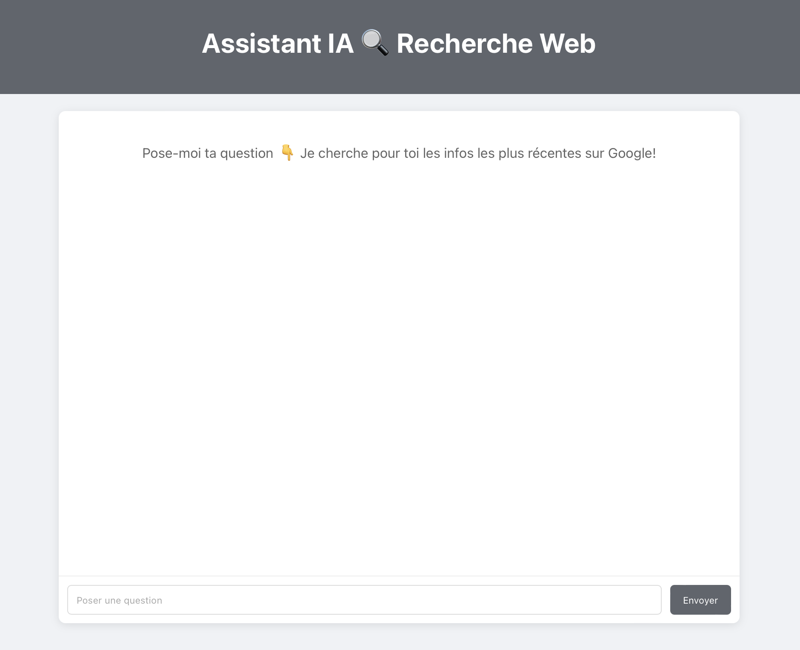
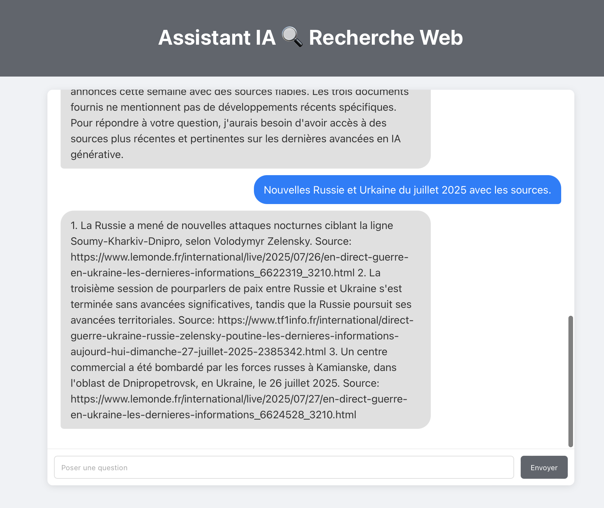

# Assistant IA 🔎 Recherche Web 
Un chatbot simple capable d’accéder à Internet pour rechercher des informations et générer des réponses pertinentes en s’appuyant sur des contenus fiables et récents. Il accède au moteur de recherche Google, filtre les pages par mots-clés et par date, extrait un court résumé de chaque page ainsi que le lien vers la source, puis intègre ces informations dans la réponse générée.

# Stack technique
- Backend : Python, FastAPI
- Frontend : React
- Web search : SerpAPI

# LLMs open source
- qwen-2.5-72b-instruct (via OpenRouter)
- mistral:7b (en local via Ollama)

# Orchestration 
- LangGraph
- Architecture modulaire

# Prérequis
- installer ollama en local (https://ollama.com)
- télécharger mistral en local: ollama pull mistral:7b
- SERPAPI_API_KEY
- OPENROUTER_API_KEY
  
# Mode local
Terminal 1 (backend): uvicorn main:app --reload
http://localhost:8000
Terminal 2 (frontend): npm start 
http://localhost:3000

# Partie 2 Architecture et déploiement en production 
- Déploiement d’un Agent IA (FastAPI + React) sur Azure avec CI/CD
Prérequis :
- Compte GitHub actif
- Projet backend avec main.py, requirements.txt (+ Dockerfile si déploiement via conteneur)
- Projet frontend avec package.json
- Compte Azure actif
- Abonnement active pour App Services
- Groupe de ressources créé dans Azure

1. Backend (FastAPI)
- Pousser le code sur GitHub
- Créer une Web App sur Azure
(Azure Portal → App Services → Créer une application Web)
- Choisir pile d’exécution : Python 3.13
- Choisir méthode de déploiement : GitHub Actions
- Connecter le repo GitHub (Lien le compte GitHub, Organisation, Dépôt, Branche)
- Configuration automatique:
→  crée un pipeline CI/CD avec GitHub Actions pour déployer automatiquement à chaque push
→ installe les dépendances à partir de requirements.txt
→ livre un lien public d’API 
- Configurer les clés API / variables d’environnement
  (Azure App Settings / GitHub Secrets)
  
2.Frontend (React)
- Pousser le code sur GitHub
- Créer une application web statique
( Azure Portal → App Services → Créer une application Web statique)
-  Choisis un plan d’hébergement: Free / Standard / Dedicated
- Connecter le repo GitHub : (Lien le compte GitHub, Organisation, Dépôt, Branche)
- Configuration automatique:
→ crée un pipeline CI/CD avec GitHub Actions
→ installe les dépendances à partir de package.json
→ livre un lien public d’API interface

3. Connexion Frontend ↔ Backend

4. Monitoring post-deployment : Azure Monitor pour gérer les logs, les metriques, les alertes. 

Coût mensuel : 500 requêtes/jour =  25€/mois

# Partie 3 Vision Language Model
Pas de configuration avec GPU 
Pour traiter des documents contenant à la fois du texte et des éléments visuels (images, graphiques, schémas) dans un pipeline RAG, on peut convertir chaque page ou bloc du document en image, en extraire le texte, puis générer une requête représentative (query) pour chaque unité de contenu. Ces données (image, texte, requête) sont stockées dans un fichier Parquet structuré. Ensuite, pour répondre à une question utilisateur, on transforme ce dataset en une base vectorielle multimodale : on encode à la fois le texte et l’image avec un modèle VLM, ce qui permet de faire une recherche sémantique efficace sur les documents complexes.

# Optimisations à réaliser :
- Utiliser un moteur d’indexation vectorielle
- Limiter la longueur du contexte
- Batcher les requêtes externes
- Garder la trace des sources
- Optimiser les prompts pour le résumé et la génération des réponses adaptées aux cas concrets
- Créer un système de gestion des erreurs
- Mettre en place un système de gestion des limites de taux (rate limiting)
- Ajuster la température du LLM 
  
# Demo :

